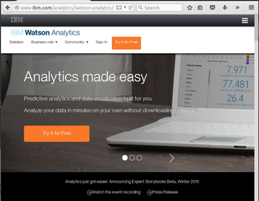
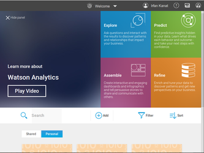

# IBM Watson Tingamajik

>"The world is full of obvious things which nobody by any chance ever observes."
>
>Sherlock Holmes in Hound of Baskervilles
>
>Arthur Conan Doyle, 1902

IBM has recently made the [Jeopardy winning Watson](http://arstechnica.com/information-technology/2013/11/ibm-opens-jeopardy-winning-watson-to-developers-with-a-self-service-cloud/) available as a digital assistant for predictive analytics. [Watson Explorer](http://www.ibm.com/smarterplanet/us/en/ibmwatson/explorer.html) allows natural language queries on data to be answered by Watson. Currently Watson Explorer allows basic data manipulation, visualization, predictive modelling and reporting. All of which are interestingly the topics of a recent R workshop taught here in ASU. 

In this tutorial and the following assignment we will go over some of the same examples covered in the R workshop. We will see how the same results can be achieved with Watson Explorer, and understand if IBM's pride in Watson Explorer is earned or is just over confidence.

## Get into Watson Analytics

Currently IBM is offering free trials of the Watson environment. Let us get enrolled into the trial program. The approval takes a bit of time, so you may want to do this early. Click on the try for free button and fill out the application.

After you log in, you will see a screen like the one depicted below. You can see it has four panes on top right of the screen: Explore, Predict, Assemble, and Refine. These correspond respectively to, descriptive visualizations, model fitting, reporting and data manipulation. The core of every predictive analytics endeavor is represented here. The bottom part which is partially concealed is reserved for data sets you are currently working on.

## Importing Data

In this exercise we will use [1974 Motor Trends Magazine dataset](http://www.jstor.org/stable/2530428). The dataset consists of 32 observations (cars) of 11 variables listed below.

* mpg: Miles per gallon
* cyl: Number of cylinders
* disp: Displacement
* hp: Horse Power
* drat: Rear axle ratio
* wt: Weight thousand lbs
* vs: V/S (I know...)
* am: Transmission (0 = a, 1 = m)
* gear: Number of forward gears
* carb: Number of carburetors

## Implications for Future

Labor replacement