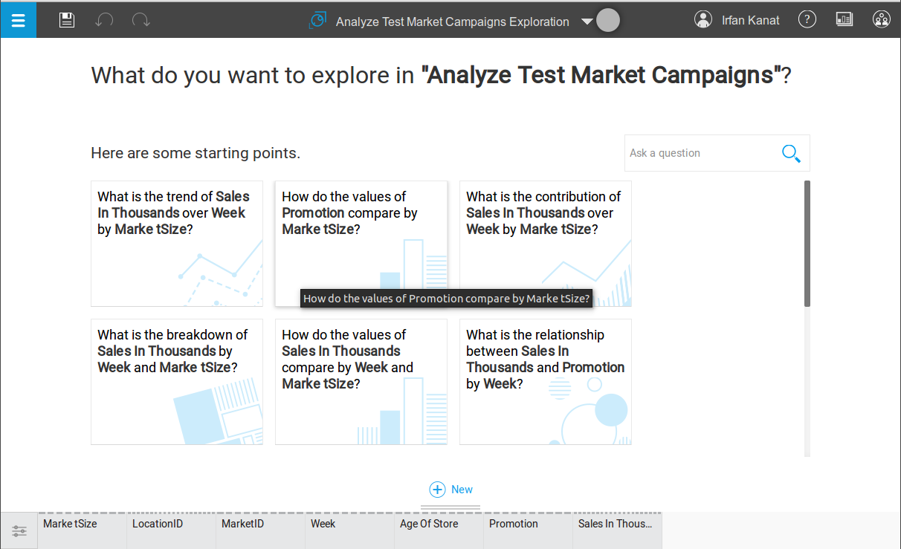
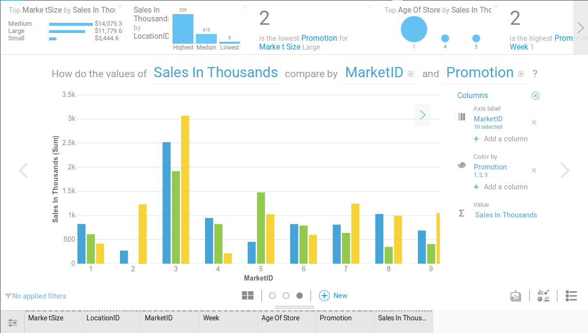

# IBM Watson Tingamajik

>"The world is full of obvious things which nobody by any chance ever observes."
>
>Sherlock Holmes -Hound of Baskervilles
>
>Arthur Conan Doyle, 1902

IBM has recently made the [Jeopardy winning Watson](http://arstechnica.com/information-technology/2013/11/ibm-opens-jeopardy-winning-watson-to-developers-with-a-self-service-cloud/) available as a digital assistant for predictive analytics. [Watson Explorer](http://www.ibm.com/smarterplanet/us/en/ibmwatson/explorer.html) allows natural language queries on data to be answered by Watson. Currently Watson Explorer allows basic data manipulation, visualization, predictive modeling and reporting. Coincidentally these are also the topics of a recent R workshop taught here in ASU. 

In this tutorial and the following assignment we will go over visualization examples covered in the R workshop. We will see how the same results can be achieved with Watson Explorer, and understand if IBM's pride in Watson Explorer is earned or is just over confidence.

## Get into Watson Analytics

Currently IBM is offering free trials of the Watson environment. Let us get enrolled into the trial program. The approval takes a bit of time, so you may want to do this early. In the main page of [Watson Explorer](https://watson.analytics.ibmcloud.com) (Figure 1) Click on the try for free button and fill out the application.

After you log in, you will see a screen like the one depicted below. You can see in Figure 2 that, it has four panes on top right of the screen: Explore, Predict, Assemble, and Refine. These correspond respectively to, descriptive visualizations, model fitting, reporting and data manipulation. The core of every predictive analytics endeavor is represented here. The bottom part which is partially concealed is reserved for data sets you are currently working on.

## Importing Data

In this exercise we will use [1974 Motor Trends Magazine dataset](http://www.jstor.org/stable/2530428). The dataset consists of 32 observations (cars) of 11 variables listed below.

* **mpg**: Miles per gallon
* **cyl**: Number of cylinders
* **disp**: Displacement
* **hp**: Horse Power
* **drat**: Rear axle ratio
* **wt**: Weight thousand lbs
* **vs**: V/S (I know...)
* **am**: Transmission (0 = a, 1 = m)
* **gear**: Number of forward gears
* **carb**: Number of carburetors

Download the [data file](https://github.com/iekanat/emba/blob/master/data/mtcars.csv) from the github repository for this tutorial.

You will see the  in the middle of the screen. Click the add button, and in the pop-up menu (Figure 3) select 'upload data' to give Watson your dataset.

After a brief period your data should appear in the lower half of the screen (Figure 4). You should see a card for your dataset here, top half (brown color) indicating the quality of the dataset based on missingness and variance of variables. 

If you want to take a look at the data, click this part of the card and click the refine button . This will produce a spreadsheet like interface where you can select subsets of the data, or filter it according to some criteria. I won't be covering data manipulation as part of this tutorial.

## Visualizations

Let us start exploring the data visually. We will ask Watson to plot the data in certain ways, and -unlike in R workshop- I mean ask literally. Watson's natural language processing capabilities will aid it to understand what we mean. Unfortunately, Watson is still learning, so replicating everything may be a bit of a challenge.

Going back to your data card in Figure 4. Click the top half and this time click the explore button .

### Histograms

Histograms are useful to explore frequencies of categorical variables in the data. Suppose we are interested in knowing the number of cars that have different types of transmission. We would plot this kind of information with a histogram. Let us click the text box, next to the magnifying glass . Now type in your query: "number of **rows** by **am**?"

From the options provided below (Figure 5), select a bar chart (preferably with a text like "How do number of **rows** compare by **am**?"). If you can not find exactly what you are looking for, do not worry. Just select a bar chart.

You can tweak the variables, or representation in the main chart. You can click variable names to change the variables. Click **am** in the question text and replace it with **cyl**. Result should look like Figure 8.

Click the  and add color by **vs**.

If you want to turn a histogram to a bar chart, you can just change **rows** to a continuous variable like **mpg**.

If you want to save a chart or alter the type use the buttons on the lower right of the screen . 

When you are satisfied click the arrow to the side of the screen for a new question (or new button in the bottom center). 

### Scatter Plots

Scatter plots are useful in understanding relationships between two continuous variables. Let us assume we are interested in the relationship between **mpg** and **disp**. We will ask a new question.

Let us click the text box, next to the magnifying glass . Now type in your query: "relation **mpg** and **disp**" The results won't be very relevant, Watson is still learning...

Select a bubble plot and continue. Figure 9 shows what I choose. Let us get what we want from Watson. Click  and under points select add column. Select either **mpg** or **disp**. Voila! We have our scatter plot.

When you are satisfied click the arrow to the side of the screen for a new question (or new button in the bottom center). 

### Bar Charts

Bar charts are useful to explore the averages of continuous variables over different values of categorical variables. Let us say we want to know how gas mileage is related to transmission type. Let us type in "How do the values of **mpg** compare by **am**?" 

Watson will give us some alternatives, let us select the one with bars. Preferably with a question that is similar to our query. We can change the variables around a bit until we are satisfied. Figure 11 is what I was trying to get.

We can add a third dimension by altering the colors, I added **cyl**.

When happy with the visualization click the collect button  on the lower right of the screen.

## Implications for Future

>'This fellow may be very clever.' I said to myself, 'but he is certainly very conceited.'
>
>Dr. Watson, Concerning Holmes -A Study in Scarlet
>
> Arthur Conan Doyle, 1887

As the quote above signifies, is IBM's pride in Watson justified or is it a bit overblown? While Watson Explorer has all the functionality needed. Currently Watson is not very good at understanding what is needed. Make no mistake though, Watson will not stay this way for long. IBM is giving out these free trials precisely for this reason. Watson will improve at a rapid pace with the data collected from trial users and become only more useful. 

While you may not feel threatened by Watson Explorer now. Consider what IBM is trying to achieve in the light of the recent [article on predictive analytics algorithm that performed better than human analysts](http://www.fastcodesign.com/3052528/evidence/this-algorithm-is-better-at-predicting-human-behavior-than-humans-are?utm_source) in a competition. If you can teach machine learning to a machine, can it replace human analysts?