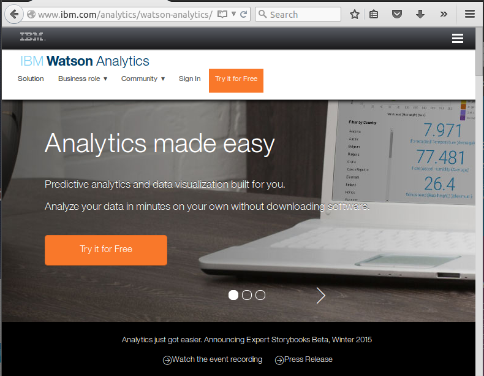
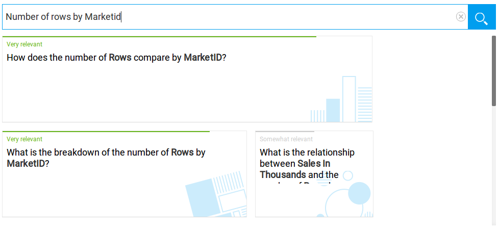
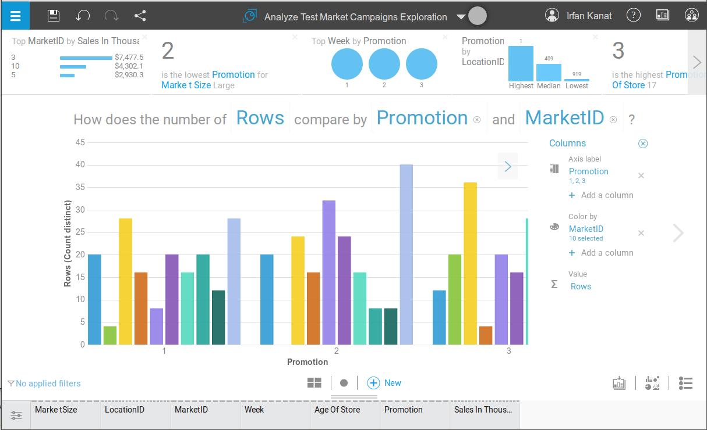
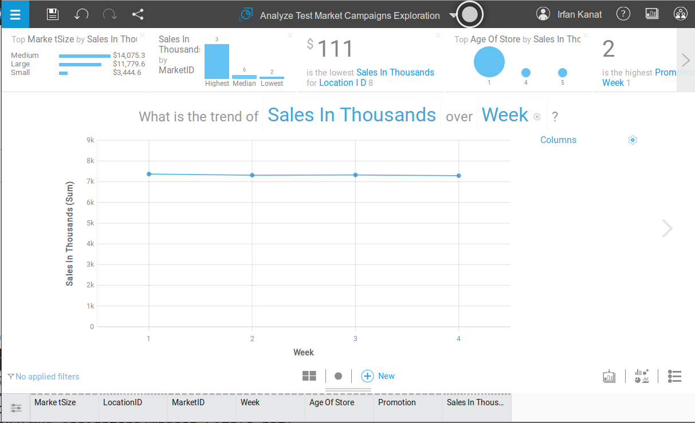
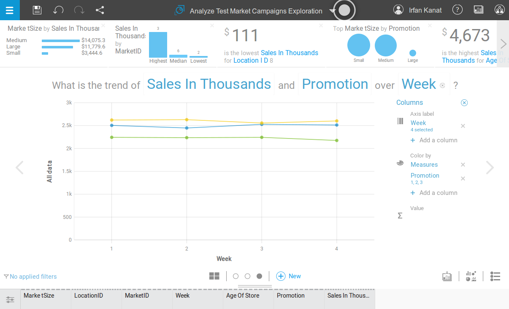
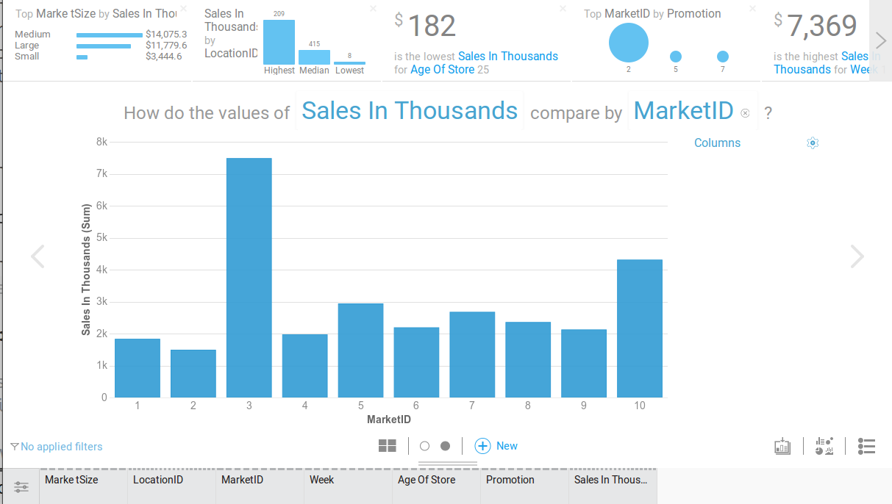

# IBM Watson Tingamajik

>"The world is full of obvious things which nobody by any chance ever observes."
>
>Sherlock Holmes -Hound of Baskervilles
>
>Arthur Conan Doyle, 1902

IBM has recently made the [Jeopardy winning Watson](http://arstechnica.com/information-technology/2013/11/ibm-opens-jeopardy-winning-watson-to-developers-with-a-self-service-cloud/) available as a digital assistant for predictive analytics. [Watson Explorer](http://www.ibm.com/smarterplanet/us/en/ibmwatson/explorer.html) allows natural language queries on data to be answered by Watson. 

Currently Watson Explorer allows basic data manipulation, visualization, predictive modeling and reporting. Coincidentally these are also the topics of a recent R workshop taught here in ASU by yours truly. 

In this tutorial and the following we will go over how Watson can be used to explore data. We will see if IBM's pride in Watson Explorer is well deserved or just over confidence.

## Get into Watson Analytics

Currently IBM is offering free trials of the Watson environment. Let us get enrolled into the trial program. The approval takes a bit of time, so you may want to do this early. In the main page of [Watson Explorer](https://watson.analytics.ibmcloud.com) (Figure 1) Click on the try for free button and fill out the application.

After you log in, you will see a screen like the one depicted below. You can see in Figure 2 that, it has four panes on top right of the screen: Explore, Predict, Assemble, and Refine. These correspond respectively to, descriptive visualizations, model fitting, reporting and data manipulation. The core of every predictive analytics endeavor is represented here. The bottom part which is partially concealed is reserved for data sets you are currently working on.

## Importing Data

In this exercise we will use Test Market Campaigns data. This is one of the sample datasets offered by IBM. The dataset consists of 7 variables listed below.

* **Market Size**: Three level categorical variable for size of market.
* **Location ID**: Identifier for individual stores.
* **Market ID**: Identifier for the market the stores are in.
* **Week**: Identifier for weeks in the 4 week period observed.
* **Age of Store**: Age of store in years.
* **Promotion**: Three level categorical for the type of promotion.
* **Sales in Thousands**: Sales in thousands of dollars.

You will see the  in the middle of the screen. Click the add button, and in the pop-up menu (Figure 3) select 'Sample Data' to get the dataset from Watson, and select the 'Analyze Test Market Campaigns' dataset.

After a brief period your data should appear in the lower half of the screen (Figure 4). You should see a card for your dataset here, top half (brown color) indicating the quality of the dataset based on missingness and variance of variables. 

If you want to take a look at the data, click the upper part of the card and click the refine button . This will produce a spreadsheet like interface where you can select subsets of the data, or filter it according to some criteria. Data manipulation won't be covered as part of this tutorial, but it is always a good idea to know what is in your data before pushing forward.

## Visualizations

Let us start exploring the data visually. We will ask Watson to plot the data in certain ways, literally. Watson's natural language processing capabilities will aid it to understand what we mean. Watson is still learning, so replicating everything may be a bit of a challenge.

Going back to your data card in Figure 4. Click the top half and this time click the explore button .

### Histograms

Suppose we are interested in knowing the number of observations from each market. This would be achieved by a histogram. Histograms are useful to explore frequencies of categorical variables in the data. We would plot this kind of information with a histogram. Let us click the text box, next to the magnifying glass . Now type in your query: "number of **rows** by **MarketID**?"

From the options provided below (Figure 5), select a bar chart (preferably with a text like "How does number of **rows** compare by **MarketID**?"). If you can not find exactly what you are looking for, do not worry. Just select a bar chart. As you may have noticed, Watson offers you tid bits of information that may be relevant to what you are looking at on the top of the screen. On the bottom is a list of variables.

You can tweak the variables, or representation in the main chart. You can click variable names to change the variables. Click **MarketID** in the question text and replace it with **Promotion**. Result should look like Figure 8. Now you know how many times each promotion was employed.

Click the  and add color by **MarketID**. Now we know how many times each promotion was employed in each market.

If you want to turn a histogram to a bar chart, you can just change **rows** to a continuous variable like **Sales in Thousands**. This bar chart shows how much money was brought by each promotion in each market.

If you want to save a chart or alter the type use the buttons on the lower right of the screen . 

When you are satisfied click the arrow to the side of the screen for a new question (or new button in the bottom center). 

### Line Plots

Let us say you are interested in the change in **Sales in Thousands** over time. Line plots are useful in understanding relationships between time and continuous variables. We can either ask a new question, or modify the existing plot. Although it is easier to modify the plot, We will ask a new question.

Let us click the text box, next to the magnifying glass . Now type in your query: "Sales in thousands over week**". Select a line plot with text like "What is the trend of **Sales in Thousands** over Week".

Figure 9 shows what we choose. As you see, the results indicate a linear trend. There is a possibility that a factor not in the plot may be driving the effects. Let us investigate the effect of promotion type. Click  and under color by select add a column. Select **promotion**. Voila!

When you are satisfied click the arrow to the side of the screen for a new question (or new button in the bottom center). 

### Bar Charts

Let us say we want to know how sales is related to market. We would use a bar chart. Bar charts are useful to explore the averages of continuous variables over different values of categorical variables.  Let us type in "How do the values of **Sales in Thousands** compare by **MarketID**?" 

Watson will give us some alternatives, let us select the one with bars. Preferably with a question that is similar to our query. We can change the variables around a bit until we are satisfied. Figure 11 shows the desired output.

We can add a third dimension by altering the colors. **Promotion** can serve as the third dimension here, and now we know which promotion works in which market.

When happy with the visualization click the collect button  on the lower right of the screen.

## Implications for Future

>'This fellow may be very clever.' I said to myself, 'but he is certainly very conceited.'
>
>Dr. Watson, Concerning Holmes -A Study in Scarlet
>
> Arthur Conan Doyle, 1887

Is IBM's pride in Watson justified or is it a bit overblown? While Watson Explorer has all the functionality needed. Currently Watson is not very good at understanding what is needed. Make no mistake though, Watson will not stay this way for long. 

IBM is giving out these free trials to improve Watson's knowledge of predictive analytics. Watson will improve at a rapid pace with the data collected from trial users and only become more useful. 

While you may not feel threatened by Watson Explorer now. Consider what IBM is trying to achieve in the light of the recent [article on predictive analytics algorithm that performed better than human analysts](http://www.fastcodesign.com/3052528/evidence/this-algorithm-is-better-at-predicting-human-behavior-than-humans-are?utm_source) in a competition. If you can teach machine learning to a machine, can it replace human analysts?